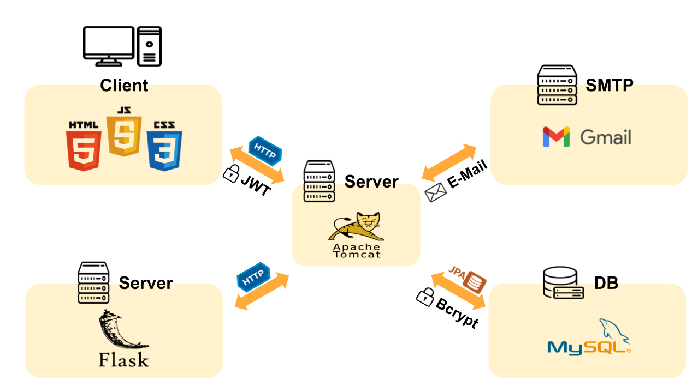

# final_project_service
 ## 📅 프로젝트 기간
2025.05.29 ~ 2025.06.26 (4주)

## ⭐ 주요 기능
* 회원가입 및 로그인
* 비밀번호 초기화
* 미세먼지 단위(PM1, PM2.5, PM10)별 모니터링 및 예측값 확인

---
## ⛏ 기술스택
<table>
    <tr>
        <th>구분</th>
        <th>내용</th>
    </tr>
    <tr>
        <td>사용언어</td>
        <td>
             
            
            
            
             
        </td>
    </tr>
    <tr>
        <td>프레임워크 & 라이브러리</td>
        <td>
            
            
            
        </td>
    </tr>
    <tr>
        <td>데이터베이스</td>
        <td>
            
        </td>
    </tr>
    <tr>
        <td>서버환경</td>
        <td>
            
            
        </td>
    </tr>
    <tr>
        <td>개발환경</td>
        <td>
             
            
        </td>
    </tr>
    <tr>
        <td>보안</td>
        <td>
            
            
        </td>
    </tr>
    <tr>
        <td>협업도구</td>
        <td>
             
            
            
        </td>
    </tr>
</table>

---

## 🎯프로젝트 목적

### 미세먼지 모니터링... 통한 ...
- ✔️ 내용
---

## 🏁 기대 효과
- 🚀 내용
  
## 역할 분배
- 👑 **문정진(팀장)** : 페이지 제작, 프로젝트 총괄
- 👨‍💻 **강예지** : 유저 페이지 제작
- 👨‍💻 **김윤서** : 페이지 디자인, 산출문서 관리
- 👩‍💻 **김정호** : 모니터링 페이지 제작
- 👨‍💻 **황준하** : 머선러닝, 데이터 분석
  
---

## Entity Relationship Diagram

## Use Case Diagram

## System Architecture

---

